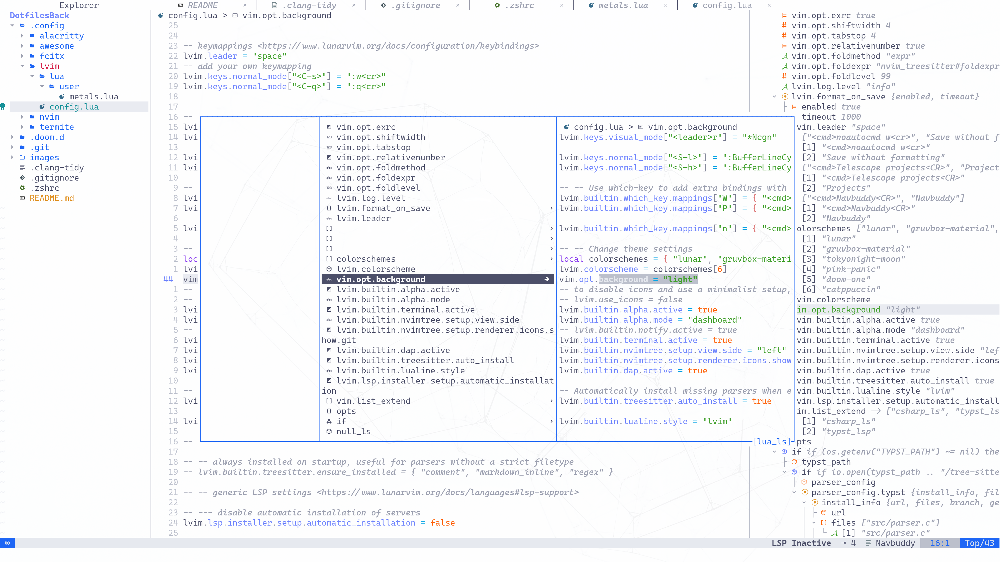
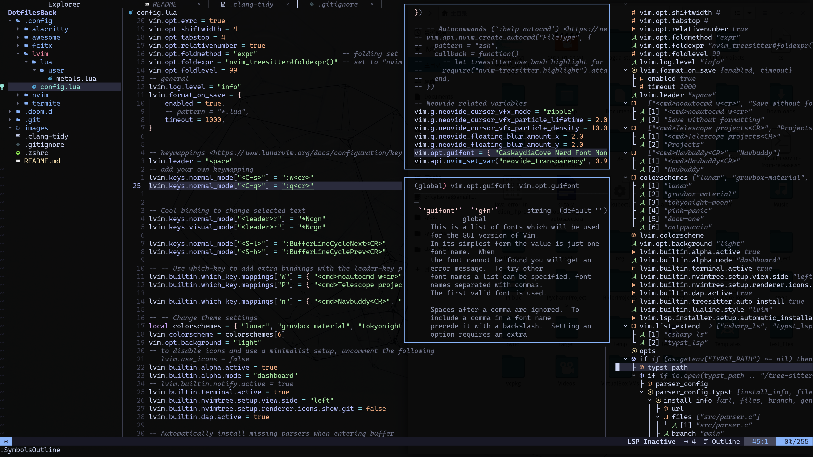

# Ericoolen's Dotfile

clang-tidy, lvim and doom configs are actively used, awesome wm config is updated occasionally, while other configurations are just there.

Plz follow the instructions from [lunarvim](https://www.lunarvim.org) and [doom emacs](https://github.com/doomemacs/doomemacs) to use them.

## lvim config

I mainly use lunarvim for C++, rust and scala dev.

## Doom emacs config

Emacs is only used for [Agda](https://github.com/agda/agda) and Org for now.

## Clang Tidy config

It is just the clang-tidy from clion, I cannot live w/o it.
